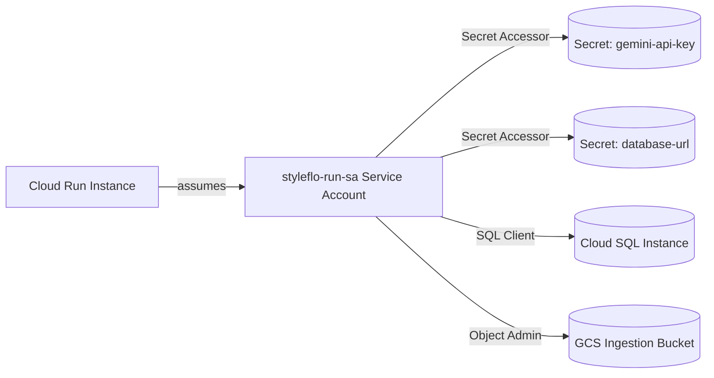

# GCP IAM Security & Least Privilege Configuration

This document specifies the IAM roles, bindings, and security policies required to run the StyleFlo Next.js RAG application securely in the `europe-west2` (London) region.

## Security Architecture

The serverless Cloud Run instance runs under a dedicated service account **`${app_name}-run-sa`** rather than using the default compute service account (which has broad editor privileges). This adheres to the **Principle of Least Privilege (PoLP)** and ensures UK GDPR compliance.



---

## 1. Secret Manager Access Policy

The service account requires access to resolve sensitive environment variables (such as the database connection URL, the Gemini API Key, and Supabase credentials) at instance startup.

### IAM Bindings (JSON Policy)
To grant access to a specific secret, apply the following IAM policy binding structure to the individual secrets:

```json
{
  "bindings": [
    {
      "role": "roles/secretmanager.secretAccessor",
      "members": [
        "serviceAccount:styleflo-run-sa@YOUR_PROJECT_ID.iam.gserviceaccount.com"
      ]
    }
  ]
}
```

### CLI Command (gcloud)
If provisioning manually, apply these commands:
```bash
# Grant access to Gemini Key
gcloud secrets add-iam-policy-binding gemini-api-key \
  --member="serviceAccount:styleflo-run-sa@YOUR_PROJECT_ID.iam.gserviceaccount.com" \
  --role="roles/secretmanager.secretAccessor"

# Grant access to Supabase service role key
gcloud secrets add-iam-policy-binding supabase-service-role-key \
  --member="serviceAccount:styleflo-run-sa@YOUR_PROJECT_ID.iam.gserviceaccount.com" \
  --role="roles/secretmanager.secretAccessor"

# Grant access to Database connection URL
gcloud secrets add-iam-policy-binding database-url \
  --member="serviceAccount:styleflo-run-sa@YOUR_PROJECT_ID.iam.gserviceaccount.com" \
  --role="roles/secretmanager.secretAccessor"
```

---

## 2. Cloud SQL Connection Policy

To securely tunnel connections from Cloud Run to Cloud SQL without exposing the database to the public internet, the instance uses the Cloud SQL Auth Proxy volume mount.

### IAM Bindings
The service account requires the `cloudsql.client` role at the **project level**:

```json
{
  "role": "roles/cloudsql.client",
  "members": [
    "serviceAccount:styleflo-run-sa@YOUR_PROJECT_ID.iam.gserviceaccount.com"
  ]
}
```

### CLI Command (gcloud)
```bash
gcloud projects add-iam-policy-binding YOUR_PROJECT_ID \
  --member="serviceAccount:styleflo-run-sa@YOUR_PROJECT_ID.iam.gserviceaccount.com" \
  --role="roles/cloudsql.client"
```

---

## 3. Cloud Storage Access Policy

For uploading scraped data files or documents, the service account needs read and write capabilities on the regional GCS bucket.

### IAM Bindings
Apply this role to the **bucket resource** directly:

```json
{
  "bindings": [
    {
      "role": "roles/storage.objectAdmin",
      "members": [
        "serviceAccount:styleflo-run-sa@YOUR_PROJECT_ID.iam.gserviceaccount.com"
      ]
    }
  ]
}
```

### CLI Command (gsutil)
```bash
gsutil iam ch \
  serviceAccount:styleflo-run-sa@YOUR_PROJECT_ID.iam.gserviceaccount.com:objectAdmin \
  gs://styleflo-store-YOUR_PROJECT_ID
```

---

## 4. Cloud Run Invocation Policy (Public Access)

To allow anonymous end-user website widgets to invoke our streaming chat route at `/api/chat/stream`, the Cloud Run service itself is configured for public access.

### IAM Bindings
Apply this role to the Cloud Run service:

```json
{
  "bindings": [
    {
      "role": "roles/run.viewer",
      "members": [
        "allUsers"
      ]
    }
  ]
}
```

### CLI Command (gcloud)
```bash
gcloud run services add-iam-policy-binding styleflo-app \
  --region="europe-west2" \
  --member="allUsers" \
  --role="roles/run.viewer"
```
